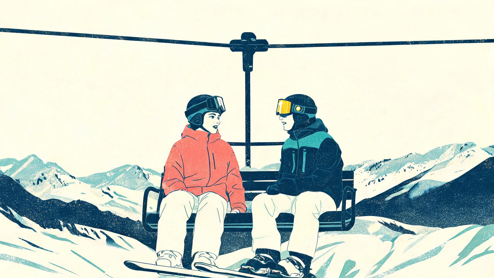
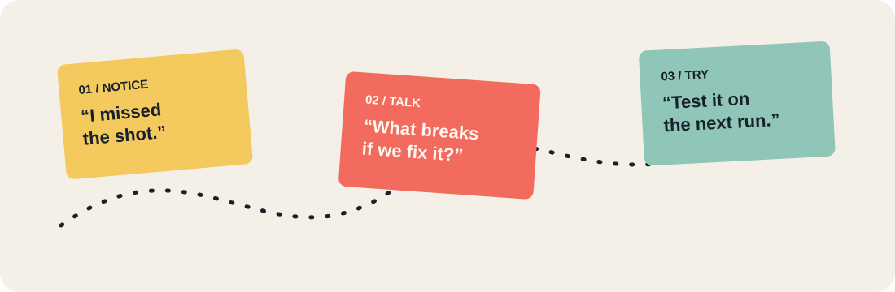
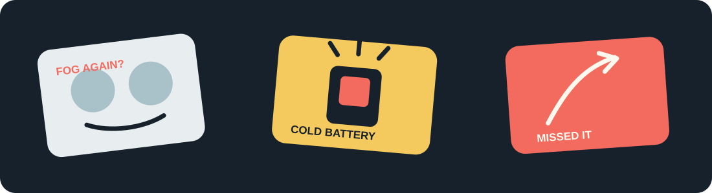

  

<strong>A public table for product decisions: turn the most annoying moments on the mountain into changes that help on the next run.</strong>

  <a href="README.md">简体中文</a> · English · <a href="README.ja.md">日本語</a>

  <a href="https://github.com/Zionlzx/chairlift-chat/issues/new?template=story.yml">Share a real moment</a> ·
  <a href="https://github.com/Zionlzx/chairlift-chat/issues/new?template=feature-request.yml">Suggest a change</a> ·
  <a href="https://github.com/Zionlzx/chairlift-chat/discussions">Join the discussion</a>

Chairlift Chat is an open product conversation for a ski camera. People bring the annoying moments they have actually lived through; others add context, push back, and vote. Maintainers write the decision and the reason in public. You do not need a PRD or a job title to join.

## 🎯 Pick the right door

| You have | Go to | Tell us |
| --- | --- | --- |
| 😅 A specific bad moment | [Real story](https://github.com/Zionlzx/chairlift-chat/issues/new?template=story.yml) | What happened, where, and how you worked around it |
| 💡 A concrete change in mind | [Feature idea](https://github.com/Zionlzx/chairlift-chat/issues/new?template=feature-request.yml) | What should change, when you need it, and its trade-offs |
| 💭 A half-formed thought | [Discussions](https://github.com/Zionlzx/chairlift-chat/discussions) | Questions, counterexamples, and alternate ways to use it |

One honest sentence is enough:

> At minus ten degrees, thick gloves made the record button impossible to hit. By the time I reacted, the best few seconds were gone.

## 🛠️ From a moment to a change

  

Every topic follows the same path: **real scene → additions and pushback → a decision → a public progress note**.

Reactions are signals, not promises. One concrete scene or counterexample can matter more than ten upvotes. Maintainers close the loop, but every decision comes with a reason.

## 🏷️ Status labels

| Label | Meaning |
| --- | --- |
| `idea` | Newly raised; collecting real situations |
| `discussing` | Comparing approaches and trade-offs |
| `planned` | On the near-term plan |
| `shipped` | Ready to try or verify |
| `declined` | Not for now; the reason stays on the issue |

Browse [Issues](https://github.com/Zionlzx/chairlift-chat/issues) by label, or see the [public roadmap](ROADMAP.md).

## 🧭 The house style

- Use plain words. Skip product theatre and empty jargon.
- Disagree with the idea, not the person. Bring a scene, a risk, or a better alternative.
- Titles and credentials are context, not authority.
- Do not promise rewards or access before they exist.

Read the [contribution guide](CONTRIBUTING.md), [governance](GOVERNANCE.md), and [code of conduct](CODE_OF_CONDUCT.md) before you jump in.

  

## 🗂️ What is on the table

The first seed topics are listed in the [roadmap](ROADMAP.md). None of them has a guaranteed ship date. Add your own scene, or tell us where the current ideas are wrong.