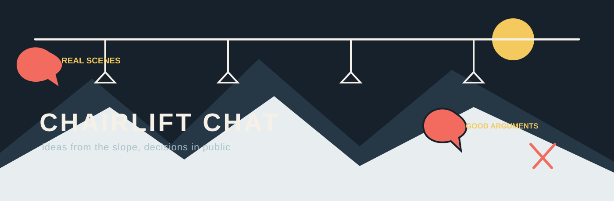

  

<strong>一张公开的产品讨论桌：把雪场里最烦的事，变成下一次滑行真的有用的改动。</strong>

  简体中文 · <a href="README.en.md">English</a> · <a href="README.ja.md">日本語</a>

  <a href="https://github.com/Zionlzx/chairlift-chat/issues/new?template=story.yml">说说一次真实经历</a> ·
  <a href="https://github.com/Zionlzx/chairlift-chat/issues/new?template=feature-request.yml">提一个改法</a> ·
  <a href="https://github.com/Zionlzx/chairlift-chat/discussions">去 Discussions 聊聊</a>

有人把雪场里遇到的麻烦写下来，大家补充、反驳、投票；维护者把结论和理由写回去。这里不需要 PRD，也不需要先证明自己是专家。滑过雪，或者被设备坑过，就有发言资格。

## 你可以做什么

| 你手上有什么 | 去哪里 | 写什么 |
| --- | --- | --- |
| 一次具体的倒霉经历 | [真实经历](https://github.com/Zionlzx/chairlift-chat/issues/new?template=story.yml) | 当时在哪、发生了什么、你怎么凑合 |
| 一个已经想好的改法 | [功能建议](https://github.com/Zionlzx/chairlift-chat/issues/new?template=feature-request.yml) | 想改什么、什么时候会用到、可能的代价 |
| 一个还没成形的念头 | [Discussions](https://github.com/Zionlzx/chairlift-chat/discussions) | 反例、问题、不同用法，先聊再决定 |

一句具体的话就够了：

> 零下十度戴着厚手套，按不到开始录制；等反应过来，最精彩的那几秒已经没了。

## 从一句话走到一次改动

  

每个话题都会经历：**真实场景 → 大家补充和质疑 → 维护者给出结论 → 公开记录进度**。

点赞只是信号。一个真实场景、一个反例，往往比十个赞更能改变决定。维护者负责收束和安排，但采纳、暂缓或放弃都会留下理由。

## 状态标签

| 标签 | 意思 |
| --- | --- |
| `idea` | 刚提出来，正在收集场景 |
| `discussing` | 有分歧，正在比较方案和代价 |
| `planned` | 进入近期计划 |
| `shipped` | 已经可以试用或验证 |
| `declined` | 现在先不做，原因写在原帖里 |

打开 [Issues](https://github.com/Zionlzx/chairlift-chat/issues) 就能按状态筛选，当前话题和去向见 [公开路线图](ROADMAP.md)。

## 社区的口味

- 说人话，少用“赋能、闭环、抓手”这类词。
- 反对一个想法没关系，最好带上自己的场景或代价。
- 身份可以自报，但身份不替观点加分。
- 不承诺还没确定的福利，也不拿头衔给意见排座次。

具体边界见 [行为准则](CODE_OF_CONDUCT.md)。想了解讨论怎么收束，看 [参与指南](CONTRIBUTING.md) 和 [治理说明](GOVERNANCE.md)。

  

## 当前桌面上的话题

第一批种子话题在 [路线图](ROADMAP.md) 里。它们都还没有被承诺排期，欢迎补充自己的场景，或者直接告诉我们哪里想得不对。
